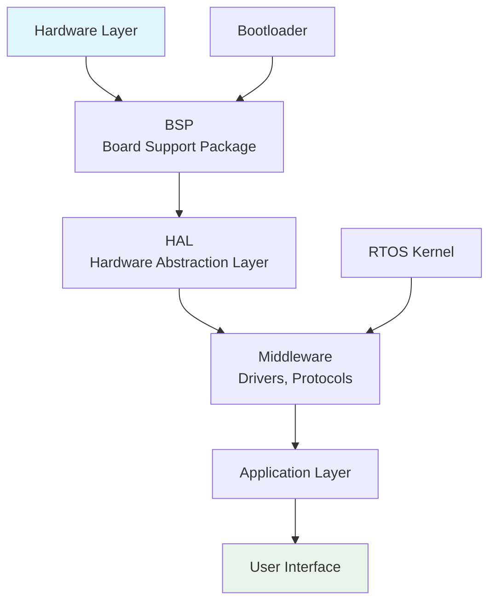

# Firmware Development Guide


## 📋 Overview

Firmware is low-level software that directly controls hardware devices. This guide covers essential concepts for embedded systems firmware development.

## 🏗️ Firmware Architecture



## 🚀 Quick Start

### Basic Firmware Template
```c
// main.c
#include "stm32f4xx_hal.h"

int main(void) {
    // 1. MCU Initialization
    HAL_Init();
    SystemClock_Config();
    
    // 2. Peripheral Initialization
    GPIO_Init();
    UART_Init();
    
    // 3. Main Loop
    while (1) {
        // Application logic
        process_data();
        handle_events();
        
        // Power management
        __WFI();  // Wait for interrupt
    }
}
```

### Project Structure
```
firmware_project/
├── src/
│   ├── main.c
│   ├── drivers/
│   │   ├── gpio.c
│   │   ├── uart.c
│   │   └── spi.c
│   ├── hal/
│   │   ├── hal_gpio.c
│   │   └── hal_uart.c
│   └── app/
│       ├── app_logic.c
│       └── state_machine.c
├── inc/          # Header files
├── scripts/      # Build scripts
├── tests/        # Unit tests
└── Makefile
```

## 🔧 Core Components

### 1. **Bootloader**
```c
// Simple bootloader flow
void bootloader_main(void) {
    // 1. Hardware init
    init_clock();
    init_memory();
    
    // 2. Check for update
    if (check_update_flag()) {
        flash_new_firmware();
    }
    
    // 3. Validate application
    if (validate_app_signature()) {
        jump_to_application();
    } else {
        enter_recovery();
    }
}
```

### 2. **Hardware Abstraction Layer (HAL)**
```c
// hal_gpio.h - Abstract GPIO operations
typedef enum {
    GPIO_LOW = 0,
    GPIO_HIGH = 1
} gpio_state_t;

void gpio_set_pin(gpio_pin_t pin, gpio_state_t state);
gpio_state_t gpio_get_pin(gpio_pin_t pin);
void gpio_toggle_pin(gpio_pin_t pin);

// Implementation for different MCUs
#ifdef STM32
    #include "stm32f4xx_hal_gpio.h"
#elif ESP32
    #include "driver/gpio.h"
#endif
```

### 3. **Device Drivers**
```c
// uart_driver.c
typedef struct {
    uint32_t baud_rate;
    uint8_t data_bits;
    uint8_t parity;
    uint8_t stop_bits;
} uart_config_t;

int uart_init(uart_port_t port, uart_config_t *config) {
    // Hardware-specific initialization
    configure_baud_rate(config->baud_rate);
    configure_fifo();
    enable_interrupts();
    
    return SUCCESS;
}

int uart_send(uart_port_t port, uint8_t *data, size_t len) {
    // Non-blocking with interrupts
    start_dma_transfer(data, len);
    return len;
}
```

### 4. **RTOS Integration**
```c
// FreeRTOS example
void vApplicationTask(void *pvParameters) {
    while (1) {
        // Wait for event
        xQueueReceive(data_queue, &msg, portMAX_DELAY);
        
        // Process data
        process_message(&msg);
        
        // Yield if needed
        taskYIELD();
    }
}

// Create tasks
xTaskCreate(vApplicationTask, "AppTask", 1024, NULL, 1, NULL);
vTaskStartScheduler();
```

## ⚙️ Memory Management

### Memory Layout
```
0x00000000: Bootloader       (32KB)
0x00008000: Application      (256KB)
0x00048000: Configuration    (4KB)
0x00049000: Log Storage      (16KB)
0x0004D000: OTA Buffer       (64KB)
```

### Static vs Dynamic Allocation
```c
// Static allocation (preferred in firmware)
static uint8_t buffer[1024];        // .data or .bss section
static const char *messages[] = {   // .rodata section
    "Hello", "World", "Firmware"
};

// Dynamic allocation (use cautiously)
void *pool = malloc(POOL_SIZE);     // From heap
if (pool == NULL) {
    // Handle error - firmware should not crash!
    system_reset();
}

// Memory pools (better approach)
static uint8_t memory_pool[4096];
mempool_init(memory_pool, sizeof(memory_pool));
void *block = mempool_alloc(256);
```

## 🔐 Security Essentials

### Secure Boot
```c
// Verify firmware signature
bool verify_firmware_signature(void *firmware, size_t size) {
    uint8_t signature[SIG_SIZE];
    uint8_t public_key[PUB_KEY_SIZE];
    
    // 1. Extract signature from firmware
    extract_signature(firmware, signature);
    
    // 2. Hash the firmware
    uint8_t hash[HASH_SIZE];
    sha256_hash(firmware + SIG_SIZE, size - SIG_SIZE, hash);
    
    // 3. Verify with public key
    return rsa_verify(public_key, hash, signature);
}
```

### Encrypted Storage
```c
// AES encryption for sensitive data
void store_credentials(uint8_t *credentials, size_t len) {
    uint8_t iv[IV_SIZE];
    uint8_t key[KEY_SIZE];
    
    generate_random(iv, IV_SIZE);
    
    // Encrypt
    uint8_t encrypted[len];
    aes_encrypt(credentials, len, key, iv, encrypted);
    
    // Store IV + encrypted data
    flash_write(STORAGE_ADDR, iv, IV_SIZE);
    flash_write(STORAGE_ADDR + IV_SIZE, encrypted, len);
}
```

## 📡 Communication Protocols

### UART/Serial
```c
// Frame structure
typedef struct {
    uint8_t sync;      // 0xAA
    uint8_t cmd;
    uint16_t len;
    uint8_t data[];
    uint16_t crc;
} serial_frame_t;

// Send frame
int send_frame(uint8_t cmd, uint8_t *data, uint16_t len) {
    serial_frame_t frame;
    frame.sync = 0xAA;
    frame.cmd = cmd;
    frame.len = len;
    memcpy(frame.data, data, len);
    frame.crc = calculate_crc(&frame, sizeof(frame) - 2);
    
    return uart_send((uint8_t*)&frame, sizeof(frame));
}
```

### I2C Driver
```c
// I2C transaction
int i2c_read_register(uint8_t dev_addr, uint8_t reg, uint8_t *data, size_t len) {
    // Start + Write device address
    i2c_start();
    i2c_write_byte(dev_addr << 1);
    
    // Write register address
    i2c_write_byte(reg);
    
    // Repeated start + Read
    i2c_start();
    i2c_write_byte((dev_addr << 1) | 0x01);
    
    // Read data
    for (size_t i = 0; i < len; i++) {
        data[i] = i2c_read_byte(i == len - 1);
    }
    
    i2c_stop();
    return SUCCESS;
}
```

## 🔄 Firmware Update (OTA)

### OTA Process
```c
// OTA state machine
typedef enum {
    OTA_IDLE,
    OTA_DOWNLOADING,
    OTA_VALIDATING,
    OTA_UPDATING,
    OTA_FAILED
} ota_state_t;

bool handle_ota_update(void) {
    switch (ota_state) {
        case OTA_IDLE:
            if (check_for_update()) {
                ota_state = OTA_DOWNLOADING;
            }
            break;
            
        case OTA_DOWNLOADING:
            if (download_chunk()) {
                ota_state = OTA_VALIDATING;
            }
            break;
            
        case OTA_VALIDATING:
            if (validate_firmware()) {
                ota_state = OTA_UPDATING;
                prepare_for_update();
            } else {
                ota_state = OTA_FAILED;
            }
            break;
            
        case OTA_UPDATING:
            flash_firmware();
            reboot();
            break;
    }
    return true;
}
```

## 🧪 Testing & Debugging

### Unit Testing Framework
```c
// test_framework.h
#define TEST_ASSERT(condition) \
    if (!(condition)) { \
        printf("FAIL: %s:%d\n", __FILE__, __LINE__); \
        return false; \
    }

bool test_gpio_operations(void) {
    TEST_ASSERT(gpio_init() == SUCCESS);
    TEST_ASSERT(gpio_set_high(PIN_LED) == SUCCESS);
    TEST_ASSERT(gpio_get_value(PIN_LED) == HIGH);
    return true;
}

// Run all tests
void run_test_suite(void) {
    test_gpio_operations();
    test_uart_communication();
    test_memory_functions();
}
```

### Debug Logging
```c
// debug_log.h
#ifdef DEBUG_ENABLED
    #define LOG_DEBUG(fmt, ...) \
        printf("[DEBUG] %s:%d: " fmt "\n", \
               __FILE__, __LINE__, ##__VA_ARGS__)
    #define LOG_HEX(data, len) \
        print_hex_dump(data, len)
#else
    #define LOG_DEBUG(fmt, ...)
    #define LOG_HEX(data, len)
#endif

// Usage
LOG_DEBUG("Initializing module: %s", module_name);
LOG_HEX(buffer, sizeof(buffer));
```

## 🚨 Error Handling

### Error Codes
```c
typedef enum {
    ERR_NONE = 0,
    ERR_INVALID_PARAM = -1,
    ERR_TIMEOUT = -2,
    ERR_MEMORY = -3,
    ERR_HARDWARE = -4,
    ERR_COMMUNICATION = -5,
    ERR_SECURITY = -6
} error_t;

// Function with error handling
error_t initialize_peripheral(void) {
    if (!hardware_present()) {
        return ERR_HARDWARE;
    }
    
    if (configure_registers() != SUCCESS) {
        return ERR_COMMUNICATION;
    }
    
    return ERR_NONE;
}

// Error recovery
void handle_error(error_t err) {
    switch (err) {
        case ERR_HARDWARE:
            disable_peripheral();
            schedule_retry();
            break;
        case ERR_MEMORY:
            free_resources();
            reboot_system();
            break;
        default:
            log_error(err);
            continue_operation();
    }
}
```

## 🛠️ Build System

### Makefile Example
```makefile
# Firmware Makefile
CC = arm-none-eabi-gcc
CFLAGS = -mcpu=cortex-m4 -mthumb -Wall -O2
LDFLAGS = -T linkerscript.ld -nostartfiles

SRCS = src/main.c src/drivers/*.c src/hal/*.c
OBJS = $(SRCS:.c=.o)

TARGET = firmware.bin

all: $(TARGET)

$(TARGET): $(OBJS)
	$(CC) $(LDFLAGS) -o firmware.elf $(OBJS)
	arm-none-eabi-objcopy -O binary firmware.elf $@

%.o: %.c
	$(CC) $(CFLAGS) -c $< -o $@

flash: $(TARGET)
	openocd -f board.cfg -c "program $(TARGET) verify reset"

clean:
	rm -f $(OBJS) firmware.elf $(TARGET)
```

## 📊 Best Practices

### Code Quality
1. **Use static analysis**: `cppcheck`, `clang-tidy`
2. **Enable all warnings**: `-Wall -Wextra -Werror`
3. **Document APIs**: Doxygen comments
4. **Version control**: Git with semantic versioning
5. **Code review**: Mandatory for critical code

### Safety Critical
1. **Watchdog timer**: Always enable
2. **Stack overflow protection**: Use MPU/stack guards
3. **Input validation**: Sanitize all inputs
4. **Defensive programming**: Assume failures
5. **Graceful degradation**: Handle failures gracefully

## 📈 Performance Optimization

### Techniques
```c
// 1. Use const where possible
const uint8_t LOOKUP_TABLE[] = {0,1,2,3,4};

// 2. Inline small functions
static inline uint32_t swap_bytes(uint32_t x) {
    return __builtin_bswap32(x);
}

// 3. Use bit operations
#define SET_BIT(reg, bit)    ((reg) |= (1 << (bit)))
#define CLEAR_BIT(reg, bit)  ((reg) &= ~(1 << (bit)))

// 4. Minimize interrupt latency
void __attribute__((interrupt)) timer_isr(void) {
    // Keep ISR short
    clear_interrupt_flag();
    set_event_flag();  // Process in main loop
}
```

## 🔗 Useful Resources

### Tools
- **Compilers**: GCC ARM, LLVM/Clang
- **Debuggers**: GDB, OpenOCD, J-Link
- **IDEs**: VS Code, Eclipse, Keil, IAR
- **Analysis**: Valgrind, cppcheck, clang-tidy

### Libraries
- **RTOS**: FreeRTOS, Zephyr, ChibiOS
- **Protocols**: lwIP, FatFS, FreeModbus
- **Security**: mbed TLS, wolfSSL
- **Testing**: Unity, CppUTest

### Standards
- **MISRA C**: Safety guidelines
- **ISO 26262**: Automotive safety
- **IEC 61508**: Industrial systems

---
**Remember**: Firmware runs directly on hardware. Write robust, predictable, and maintainable code. Always consider power consumption, real-time requirements, and safety implications.

*Happy Coding! 🎯*
